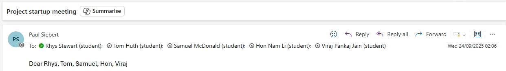

# Meeting Notes for Project Week 1

## September 24th, 2025

**Present**: 
- Rhys Stewart (Me, Student) 
- Tom Huth (Student) 
- Samuel McDonald (Student)
- Hon Nam Li (Student)
- Viraj Pankaj Jain (Student)
- Dr. Jan Paul Siebert (Supervisor)

---

### Achieved in the Current Week:

- I have compiled a set of notes that breaks down the project description into actionable steps, and links each topic with real ideas and possible places to research/link into

- I have started to compile a list of useful resources that may help with project development (e.g. blogs on CNNs and how to build Neural Networks)

- I have begun learning what CNNs are and how to create them

- I have begun learning what Neural Networks are and how to create them

- I have successfully installed the ViZDoom repository and have managed to launch their `basic.py` script to ensure that everything has been set up correctly

---

### Notes from Meeting:

- Supervisor believes that the dissertation is very important, and is much like writing code

- Has expectation for a predominantly working piece of software by the end of the year (has stated that this isn't a strict deadline as things happen) as this will make the biggest difference towards better marks

- swat technique: Strengths, weaknesses, opportunities, threats on 

- Level 1 design specification

- outline design

- Use an LLM to design the system to test it out first

- see if the examples have been done before

- start the dissertation being concise and easy as possible for the reader to understand, treat the reader like they're "stupid"

- This project can be whatever I choose it to be. The supervisor has made it very clear that the project direction can go anywhere within reasonable bounds. 

---

### Questions:

- **At what time every week are you available to have a meeting? Are you able to dedicate the same time or would regular email correspondence work better?**

    Answer: Thursdays, in person is the aim. This will be ironed out and communicated as soon as possible
      

- **Here is my understanding of the project so far:**

    1. Design test scenarios/environments where small improvements in vision systems can be clearly measured - This would involve Developing ViZDoom Test Scenarios (The Evaluation Suite)

    2. Build or adapt a vision system that can interact with that environment - create CNNs with reinforcement learning to tackle the problems. This would use libraries like PyTorch

    3. Evaluate whether the system (or another's) shows measurable improvements on visual processing tasks - Establish a baseline and compare with another model that has an "improvement"

    What have I missed? 

    Answer:

    -  produce a development plan, what are the key functions the system should be to do and provide

    - running the game, showing the model it and getting it to build and navigate

      

- **From our meetings, how would you like my progress to be conveyed to you? Status reports, slides,** ....

    Answer: Status reports are requested for every week in a presentable format. These should be emailed and brought with to in person meetings
      

- **What is your preferred method of communication? I am happy to oblige any**

    Answer: Email is best, if possible, avoid teams. 
      

- **Are you needing access to any code and documentation that I produce early on?**

    Answer: not that important, as a good baseline provide it, especially if to demonstrate work completed etc... However, is not interested in looking over code unless absolutely necessary.
      

- **Does this project require a specific licensing? E.g. can it be open source through an MIT license or does it need to remain private?**

    Answer: No, is up to myself. 
      

- **Are there any strict software or hardware requirements?**

    Answer: No.
      

- **Do you have any seed papers?**:

    Answer: Not at the moment. The supervisor will do some research and get back to me on this. 
      

---

### Objectives for this Week:

- Compare other game engine APIs similar to ViZDoom before making the concrete decision to use ViZDoom

- Begin the dissertation template 
- Initiate the project repository on GitHub
- Build specification

- When building the specification, create the functional requirements.

- Complete the following:

    - The big picture vision (the why)
    - The realistic goal within the scope of the project (the what)
    - The high level features to be implemented (the detail)
    - The minimum viable product (MVP) (the priorities)

---

### Additional Notes

- **IMPORTANT NOTE**: supervisor emailed at 02:06 in the morning to arrange a meeting with all his students he is supervising. Further details can be seen here:

    