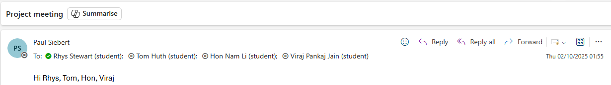

# Meeting Notes for Project Week 1

## September 24th, 2025

**Present**: 
- Rhys Stewart
- Dr. Jan Paul Siebert (Supervisor)

---

### Achieved in the Current Week:

- Began learning how to use ViZDoom and have managed to create a basic CNN that can play Doom. 
- To accomplish this, I followed the tutorial by [RLHugh](https://www.youtube.com/@rlhugh).

---

### Notes from Meeting:

- Projects have already been done to prove ViZDoom's usefulness as a tool. Thus, stick with the research question: 
     **"Can VisDoom detect meaningful visual processing improvements that static benchmarks miss?"**

- The question "What considerable progress would the assistance of an AI model provide within this project?" was proposed by the supervisor.  

---

### Questions:

Due to time constraints from a rushed recovery of meeting, there was inadequate time for questions. This should be rectified and questions noted and asked for next week. 

---

### Objectives for this week:

- Finish ViZDoom and CNN learning to begin on scenario development 
- Email during the beginning of the week to arrange a suitable meeting. 

- Ensure progress is correctly recorded on the repository (where applicable). This includes meeting notes, `timelog.md` and `plan.md`. 

- Ensure that the dissertation template is updated in regards to any development achieved. 

- Ensure questions for the meeting are included as part of the weekly status report presentation to ensure that all questions can be accounted for. 

---

### Additional Notes

- Supervisor emailed at 01:55 in the morning to arrange a meeting. See below:

    

    I was unable to attend due to conflicts with my university schedule. An alternative meeting was agreed for the day after (Friday the 3rd at 14:00), however, the supervisor did not attend and provided no notification to communicate this. 

